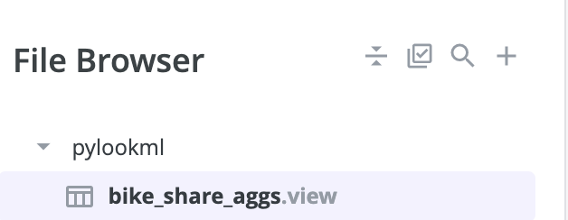
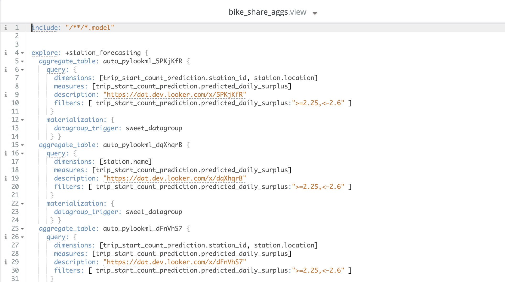

Autotune your model using PyLookML
------------------------------------

PyLookML offers a command line interface (CLI) which offers several commands, one of which is autotune.
It will automatically create aggregate awareness tables inside of your LookML model based on the most frequently run queries and commit to a
developer branch so that you can confirm the output first.

Let's get started with an example:
Ensure that you have installed it using pip, which will bind the lookml command. **Note**: if you install it in a virtual environment 
the lookml command will only be available when the virtual environment is active.

::

    pip install lookml 

We will be using a cli command 'lookml autotune' which will search for a file in your current directory called autotune.ini.

* pyLookML look for an autotune.ini file in the current working directory
* Your autotune.ini should look like this:

.. code-block:: bash

    [autotune]
    access_token = xxx
    looker_host = https://mycompany.looker.com:19999
    api_client = xxx
    api_secret = yyy
    model_name = bike_share
    branch = dev-john-doe-yddt

Then on the command line you can run:

::

    lookml autotune

If your autotune.ini is stored in a different location, you can provide the path by running

:: 

    lookml autotune useconfig

and you will be prompted to provide the path

If you would like to provide each bit of info interactively run:

::

    lookml autotune guided

it will ask you for all the info and you can paste it in.

It may take a minute to run, but the result will be a single file with your aggregates located on the branch you provided,
allowing you to check the output before pushing to production.

