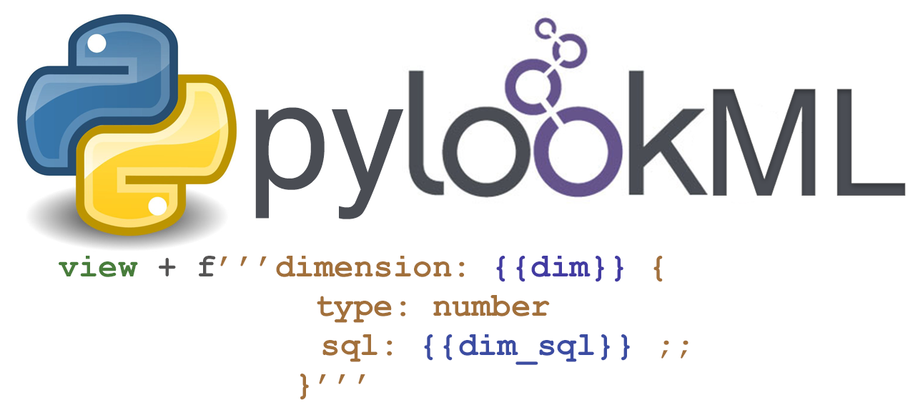

.. lookml documentation master file, created by
   sphinx-quickstart on Fri Feb 28 06:12:54 2020.
   You can adapt this file completely to your liking, but it should at least
   contain the root `toctree` directive.

Welcome 
=========================================
PyLookML allows scripting of LookML in python. It leverages the `lkml <https://pypi.org/project/lkml/>`_ parser to interpret raw lookml files then adds an object oriented syntax 
and helpful integrations to boost your productivity.
View the source code or log an issue `here <https://github.com/llooker/lookml/>`_.

.. note::  pyLookML 3.0.0, a milestone release, is now available on pip. See the changelog for details.

Why
-------------------
Sometimes usecases demand automation, where you want rules to govern the rules.
 * EAV data / frequently changing custom fields (see `EAV <EAV.html>`_)
 * Nested data
 * Applying complex patterns repeatably
 * Create LookML based on API response (such as `autotune <autotune.html>`_)
 * Bulk conversion of old reports

Quickstart
-------------------
Install pylookml package via pip

.. code-block:: bash

   pip install lookml

`Make a github access token <https://help.github.com/en/github/authenticating-to-github/creating-a-personal-access-token-for-the-command-line>`_

Fetch a viewFile from Github and print one of its dimensions

.. code-block:: python
   :linenos:

   import lookml
   proj = lookml.Project(
         repo= "llooker/pyLookMLExample",
         access_token="your_github_access_token",
         #Optional args for the deploy URL (for deploying directly to prodcution mode)
        ,looker_host="https://mylooker.looker.com/"
        ,looker_project_name="my_project"
   )
   viewFile = proj.file('01_order_items.view.lkml')
   orderItems = viewFile.views.order_items
   print(orderItems.id)

.. code-block:: 

  dimension: id {
    primary_key: yes
    type: number
    sql: ${TABLE}.id ;;
  }

Or do the same thing from any other git service (as long as you have SSH git access on the machine pyLookML is running on):

.. code-block:: python
   :linenos:

        self.proj = lookml.Project(
                 git_url='git@bitbucket.org:myorg/russ_sandbox.git'
                 #Optional args for the deploy URL (for deploying directly to prodcution mode)
                ,looker_host="https://mylooker.looker.com/"
                ,looker_project_name="my_project"
        )

This works for bitbucket, gitlab, or private git servers.

**How to reference objects**
The taxonomy is basically as follows
project>file>'views'>viewname>fieldname>property  
project>file>'explores'>explorename>joinname>property  

.. code-block:: python

    myProject = lookml.Project(
         repo= "llooker/russ_sandbox",
         access_token="your_github_access_token",
    )
    #Use a dot operator syntax:
    myProject.file('order_items.view.lkml').views.order_items.id.primary_key.value

    #Use a dictionary like syntax:
    myProject['order_items.view.lkml']['views']['order_items']['id'].primary_key.value

Get all the way down to property values in one line of code

.. code-block:: python

    lookml.Project(**config['project1'])['order_items.view.lkml']['views']['order_items']['id'].primary_key.value

**Looping over stuff**

.. code-block:: javascript

    dimension: id {
        type: string
        sql: ${TABLE}.id ;;
        tags: ["a","b","c"]
    }

.. code-block:: python

    for tag in order_items.id.tags:
        print(tag)
    >>> 'a'
    >>> 'b'
    >>> 'c'

**Updating things**

The `+` operator in pyLookML is significant, it allows us to add a string of LookML to our object like so. 
Also notice the way we change the primary key paramter.

.. code-block:: python
   :linenos:

    order_items = lookml.View('order_items')
    order_items + '''
        dimension: id {
            type: string
            sql: ${TABLE}.id ;;
            }
    '''
    order_items.id.primary_key = 'yes'
    print(order_items)

.. code-block::

    view: order_items {
        dimension: id { 
            type: string
            sql: ${TABLE}.id ;;
            primary_key: yes 
        }   
    }

after your object is updated, you need to save it back to github, and optionally hit the looker deploy URL

.. code-block:: python
   :linenos:

    newFile = lookml.File(order_items)
    #the put method, creates or overwrites 
    myProject.put(newFile)
    #optionally hitting the Looker deploy URL (requires that you set your instance URL on project creation)
    myProject.deploy() 

    

Build from a developer version
------------------------------

*Step 1) Create a virtual env from a clean python and install the dependencies*

.. code-block:: bash

   which python3 #(this is generally the best interpreter use as the startingpoint)
   #Output: /Library/Frameworks/Python.framework/Versions/3.8/bin/python3
   mkdir lookml_test
   cd lookml_test
   virtualenv -p /Library/Frameworks/Python.framework/Versions/3.8/bin/python3 lookml_test_env
   source lookml_test_env/bin/activate
   pip install pygithub
   pip install lkml

*Step 2) go to github and look for the specific commit you'd like to build and replace it in the following command after the @ sign* 

.. code-block:: bash

   pip install git+https://github.com/llooker/lookml.git@04dbd05dd3f37a7fa624501a370df52af26bb5fc

.. toctree::
   :maxdepth: 1

   introduction
   examples
   eav
   autotune
   reference
   changelog

