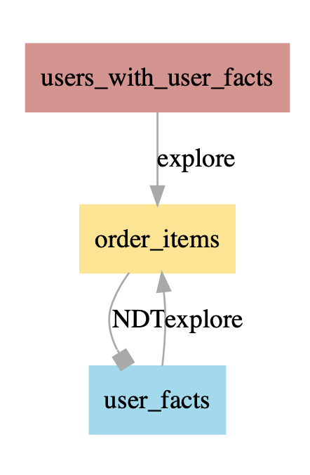
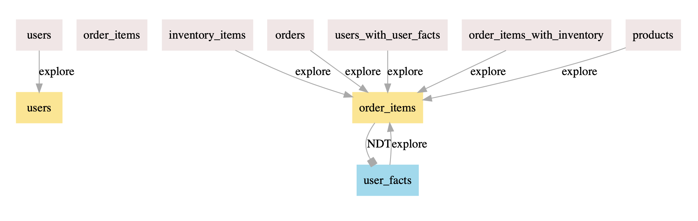

Dependency Graphing
------------------------------

What does this do?
-------------------

It is now possible to generate the dependencies of a given LookML **view** or **explore** object and visualise its dependencies, or iteratively generate all of the dependencies in the project.

This is useful if you are using Looker to do substantial data transformation, or other situations in which you have a number of downstream dependencies and need to understand the effects of renaming / modifying / deleting an object.

This requires the `graphviz library <https://pypi.org/project/graphviz/>`_ and produces dot files which can be rendered as PDF or parsed with a variety of tools.

What kind of dependencies does this pick up?

* View and explore extensions 
* Base tables and joined views in explores
* Explores referenced in the :code:`explore_source` of NDTs
* Views referenced in :code:`SQL_TABLE_NAME` inside derived tables

Basic Usage 
-------------------

* Basic usage consists of creating a project object as normal, and then calling either :py:func:`graph_dependencies` or :py:func:`graph_all_dependencies`
* Under the hood, this will build an internal representation of the objects in the project, and then recursively build the dependencies between them
* The object returned is a `graphviz.Digraph <https://graphviz.readthedocs.io/en/stable/api.html#digraph>`_ object which can then be rendered and saved
* Calling :py:func:`graph_dependencies` with a named object:

.. code-block:: python
    :linenos:

        # Create your project object as normal
        proj = lookml.Project(git_url='some_repo.git', access_token='abcd')
        # Locate an object by its LookML name and type
        graph = proj.graph_dependencies('my_great_view', 'view')
        # Render the output
        graph.render('file_name.gv', view=True)

* Example output (Note that an NDT might be joined back into its source explore, as in this example):

* Calling :py:func:`graph_all_dependencies` to generate a full map:
.. code-block:: python
    :linenos:

        graph = proj.graph_all_dependencies()
        graph.render('file_name.gv', view=True)

* Example output:

Styles 
-------------------
It is possible to customise the colours used in the chart by amending ``config.py``.
The default colours are:

* Views:               #F2E6E6 (light pink)
* SQL Derived Tables:  #C8BFF2 (light purple)
* NDTs:                #92DBEF (light blue)
* Explores:             #FFE587 (yellow)

Additionally, if you choose to graph the dependencies of a specific object, this object will be coloured red.

Known limitations
-------------------

* This currently does not recognise refinements or Looker's new filter syntax (they are not recognised by the `lkml <https://github.com/joshtemple/lkml/issues/32>`_ library which this uses for parsing)
* This only plots dependencies at the explore / view level, and not at the level of individual fields
* i.e. it does not look at dimensions, measures, sets, filters, links, etc.
* This works within the scope of a single project and so cannot visualise dependencies that span across projects (i.e. if you are using project import)
* This does not look at how code may be modified by extensions or refinements, and so it will only pick up dependencies that are defined explicitly in the code.
